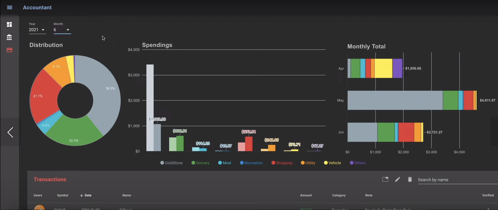

# Finance tracking and expence app (CRUD)

## PLaid API
>Use the API [Plaid.com](https://plaid.com/) first 100 accounts is free, it has official node.js client library, expense tracking, net worth tracking, and documentation.

## Database (MongoDB)
> A good place to place to store the data of customers.

## Data Syncronizer 
> Google Firebase: to run periodically on a sec schedule to i.e. every day. (Part of the backend.)

### CRUD

>GET/POST/PUT/DELETE Expense API

>GET/POST/PUT/DELETE Balance API

* Use their official node client Plaid-Node
* Use MongooseJS for communicating with MongoDB.
* Create at least two tables: transactions and balances.
* Design your background job to periodically request financial data from Plaid and store them in your database. 
* Implement authentication and authorization

### Wireframe
The look and design of the app should be similar to that. 

### ERD 
The basic ERD for tracking expenses in a finance app.
